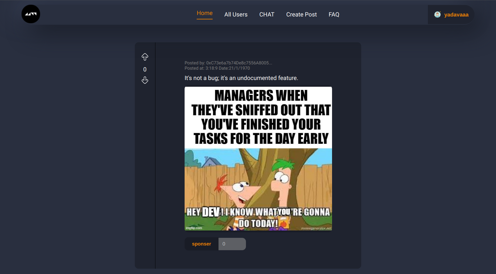

# Decentralized Social Media Project

website link-[blockConnect11.vercel.app/](blockConnect11.vercel.app/)

Welcome to Block Connect! This is a fun project where I have implemented a basic, functional social media platform. Here, users can share memes and chat with each other, all built on top of blockchain technology.

## Table Of Contents
- Overview
- Creating a New Account
- Features
- Technologies Used
- Setup and Installation
- License

## Overview
This is an exciting project where I implemented a social media application for programmers based on blockchain technology, hence the name "BlockKonnect." Users can chat, make friends, post memes, like or dislike content, and even promote posts by donating cryptocurrency. The platform combines the community aspects of social media with the innovative features of blockchain, creating a unique space for programmers to connect and interact.

## Creating a New Account
Ensure you have installed metamask Extension.
After reloading the page allow metamask to add the network and switch to that network.
Get your Polygon Amoy MATIC from https://faucet.polygon.technology/
Write the name of your account and click create account to successfully create your account.

## Features
Creation and Sharing of Posts .
Chatting with your Friends . 
Donating MATICS to the creators .

## Technologies Used
Smart Contracts: Solidity
Web3 Library: ethers.js
Framework: Next.js
Ethereum Testnet: Polygon Amoy

## Setup and Installation using TESTNET
- git clone [https://github.com/lanslord11/Block-Connect](https://github.com/lanslord11/Block-Connect)
- cd Block-Connect
- npm install
### create .env file and add the variables:
- NEXT_PUBLIC_CONTRACT_ADDRESS=0x3Eeedd108AF7b49f4B7D95a3EeF796CD32B20A0B  
- NEXT_PUBLIC_PINATA_API_KEY=                 // you can get your own keys from pinata
- NEXT_PUBLIC_PINATA_SECRET_API_KEY=
- NEXT_PUBLIC_PINATA_GATEWAY_TOKEN = 
- NEXT_PUBLIC_POLYGON_MUMBAI_RPC = https://rpc.ankr.com/polygon_amoy
- NEXT_PUBLIC_PRIVATE_KEY = 0829670df9593073cc63ecd8de5727bc7eade49f9ec551b640c589d7e8225066
### Run the development server:
- npm run dev
- Open http://localhost:3000 in your browser

### License
This project is licensed under the GPL-3.0